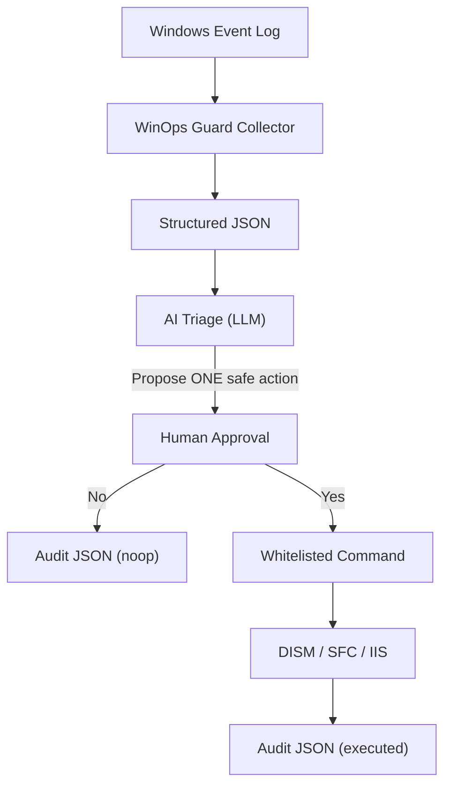

# WinOps Guard

## TL;DR (for design partners)

- WinOps Guard is a Windows-focused, safety-first CLI toolchain for approval-gated remediation with audit-grade JSON output.
- Built for MSP leads and enterprise IT/SRE owners operating **50+ Windows Servers** under RDP restrictions and audit/traceability requirements.
- Problem it addresses: Windows incidents (Update/servicing, IIS) often degrade into RDP-driven, person-dependent fixes with weak evidence trails.
- What’s different: Windows-native signal collection + AI explanation + **explicit human approval** + **single-step, whitelisted** actions + machine-readable audit records.
- Usable MVP today: the CLI pipelines below. Planned (not implemented yet): signed agent, RBAC control plane, policy approvals, immutable centralized audit logs.
- Primary value: incident owners and IT managers can **defend remediation decisions** during audits, post-incident reviews, and customer inquiries — without relying on screenshots, chat logs, or operator memory.

---

## Why now / why buy

If you are accountable for Windows operations, the hard part is not “running a command.” It’s making the decision safely and being able to defend it later:

- Senior Windows operators are scarce; institutional knowledge tends to concentrate in a few people.
- RDP-based incident response is slow, hard to govern, and difficult to audit.
- In regulated or customer-facing environments, you need repeatability: **who approved what, when, why, and what changed**.

WinOps Guard is intentionally narrow: it helps you produce a reasoned recommendation and execute exactly one safe step, only after explicit approval, with an audit record you can keep.

In many organizations, the hardest part of Windows incident response is not fixing the issue.
It is explaining — weeks or months later — **why a specific action was taken, by whom, and based on what evidence**.

WinOps Guard exists to make that explanation reliable, repeatable, and defensible by default.

---

## Operational Risk Without This

- RDP-first remediation does not hold up well in audits and post-incident review because the decision path is implicit and hard to reconstruct.
- Screenshots, chat logs, and operator memory are not durable or queryable evidence; they do not provide reliable, repeatable accountability.
- Senior Windows operators become single points of failure when only a few people can diagnose and choose safe recovery steps under pressure.
- Explaining why a change was made is often harder than executing it, especially when evidence is scattered across tools and time.

---

## Who this is for / not for

### For

- MSP and enterprise teams operating **50+ Windows Servers**
- Environments where Update/servicing issues and IIS incidents happen weekly/monthly
- Organizations with RDP restrictions (security policy, jump hosts, audit controls)
- Teams that need explainability and evidence for audits, customer reporting, or change governance

### Not for

- Fully autonomous remediation (unattended “self-healing” without approvals)
- General-purpose AI agents that can run arbitrary commands
- Replacing Microsoft tooling (Windows Update/WSUS, DISM, SFC) or your monitoring/SIEM stack

---

## Who is accountable without this

Without an explicit decision and audit layer, accountability typically falls on:

- A small number of senior Windows operators who "just know what to do"
- Incident owners who must explain decisions after the fact without durable evidence
- Managers who approve changes but cannot reconstruct the technical rationale later

WinOps Guard reduces this risk by producing a structured, machine-readable record
of **what was proposed, why it was proposed, who approved it, and what actually ran**.

---

## Microsoft relationship (not a replacement)

WinOps Guard does not replace Microsoft components or admin tooling. It uses Windows-native signals and Microsoft repair tools and adds a missing “decision/approval/audit” layer:

- Not replacing: Windows Event Log, Windows Update/WSUS, DISM, SFC, existing monitoring and SIEM
- Complementing: Windows-specific decision support, explicit approvals, and audit-grade JSON output per action

WinOps Guard does not replace Microsoft tooling. It operates above native Windows signals and uses Microsoft-provided repair commands.
Its role is decision, approval, and audit, which Microsoft tools intentionally leave to operational processes.

This layer — decision, approval, and audit — is intentionally outside the scope of Microsoft tooling,
and is where most operational and compliance risk accumulates in real environments.

---

## Architecture (at a glance)

This diagram shows the decision → approval → execution → audit flow. No action is executed without explicit human approval. Each run produces an auditable JSON record.



## What you get today / what’s planned

| Area | Today (Implemented) | Planned (Design Intent / not implemented yet) |
| --- | --- | --- |
| Signal collection | Windows Event Log collector (`winopsguard.exe`) with `-log` and `-provider` filtering | Signed, least-privilege agent |
| Triage | `winopsguard-triage` calls OpenAI or Gemini and returns JSON triage | Pluggable providers including self-hosted/offline |
| Remediation | Approval-gated, **single-step** remediation CLIs (Windows Update repair, IIS reset) | Policy-driven approvals (manual/auto), deterministic rules per incident type |
| Auditability | Each remediation emits a JSON audit record to stdout | Centralized, tamper-evident audit storage + SIEM/ITSM export |
| Governance | Human approval gate + narrow whitelists | RBAC, policy engine, execution attestation |

---

## 1-minute Quickstart (no RDP)

Prereqs:

- Windows PowerShell
- Go (to build the CLIs)
- An LLM API key (`OPENAI_API_KEY` or `GEMINI_API_KEY`)

Build:

```powershell
go build -o winopsguard-triage.exe ./cmd/winopsguard-triage
go build -o winopsguard-remediate-update.exe ./cmd/winopsguard-remediate-update
```

Run a demo with bundled test data (approval prompt is on stderr; answering `no` still returns an audit JSON record):

```powershell
$env:OPENAI_API_KEY = "..."
type testdata\windows_update_corruption.json |
  .\winopsguard-triage.exe -provider openai |
  .\winopsguard-remediate-update.exe
```

---

## Why this is safe (and not a generic agent)

WinOps Guard is built to avoid the main failure modes of “AI that changes systems”:

- **No silent changes:** every remediation requires explicit approval (`yes`/`y` only).
- **No multi-step automation:** one run performs **one** action.
- **No arbitrary execution:** remediations are fixed, whitelisted commands only.
- **Audit by default:** proposed/executed actions emit machine-readable JSON (what/when/why/result).

---

## Data handling & privacy (current behavior)

### What data is sent to the LLM?

- `winopsguard-triage` sends the JSON received on stdin to the configured provider (OpenAI or Gemini) as part of the prompt.
- Event log messages can contain environment-specific identifiers (hostnames, usernames, paths). Treat inputs as potentially sensitive.

### Are raw logs sent by default?

- If you pipe raw Event Log JSON into `winopsguard-triage`, that content is sent to the LLM provider.

### Masking / filtering expectations

- This repository does not guarantee complete redaction before LLM submission.
- For sensitive environments, redact/filter inputs before `winopsguard-triage`, or run PoCs on non-production data first.

### Offline / self-hosted LLM compatibility

- Not implemented yet. Today, `winopsguard-triage` supports OpenAI and Gemini via HTTPS.
- Design intent is provider-pluggability without changing pipeline shape.

---

## Security model (design intent)

This section describes intended enterprise properties. These are **design goals, not implemented features**.

- **Execution privilege:** a signed, least-privilege agent with clear privilege boundaries (today, CLIs run with the invoking user’s privileges).
- **Approval gate:** prevent unapproved change and clarify accountability (approver/executor).
- **Audit retention:** centralized, tamper-evident audit storage and export (today, audit JSON is emitted to stdout).
- **Policy:** deterministic remediation rules and policy-driven approvals per incident type.

---

## Enterprise readiness (design intent)

WinOps Guard is currently a CLI MVP. For enterprise deployment, the intended division of responsibility is:

- **Agent:** signed distribution, least privilege, local collection/execution, local buffering/queueing, policy enforcement
- **Control plane:** RBAC, approval workflows, audit retention, fleet management, SIEM/ITSM integrations

These are design goals, not yet implemented features.

---

## What this is NOT (procurement-oriented)

- Not a replacement for Microsoft tools (Windows Update/WSUS, DISM, SFC, Event Viewer).
- Not a replacement for monitoring or SIEM (designed to coexist with Datadog/Ansible/Splunk-style stacks).
- Not an arbitrary command runner.
- Not unattended remediation.

---

## Usage (details)

### Build (CLI toolchain)

```powershell
go build -o winopsguard.exe .
go build -o winopsguard-triage.exe ./cmd/winopsguard-triage
go build -o winopsguard-remediate-update.exe ./cmd/winopsguard-remediate-update
go build -o winopsguard-remediate-iis.exe ./cmd/winopsguard-remediate-iis
go build -o winopsguard-notify-slack.exe ./cmd/winopsguard-notify-slack
go build -o winopsguard-cvekb.exe ./cmd/winopsguard-cvekb
go build -o winopsguard-assess-hotfix.exe ./cmd/winopsguard-assess-hotfix
```

### Collector: Windows Event Log

```powershell
.\winopsguard.exe -minutes 60 -max 200
```

- `-log application|system|setup` (default: `application`)
- `-provider <ProviderName>` filters by event provider (e.g., `Microsoft-Windows-WindowsUpdateClient`)

Example:

```powershell
.\winopsguard.exe -log setup -minutes 120 -max 400 -provider Microsoft-Windows-WindowsUpdateClient
```

### Windows Update remediation (approval-gated, single-step)

```powershell
type testdata\windows_update_corruption.json |
  .\winopsguard-triage.exe -provider openai |
  .\winopsguard-remediate-update.exe
```

Notes:

- Approval prompt is printed to stderr; only `yes`/`y` executes.
- Exactly one whitelisted action is executed per run, and one audit JSON object is emitted to stdout.
- `executed=false` with `exitCode=0` is a noop (not applicable / not approved).

### CVE/KB assessment (optional; conservative by design)

This pipeline detects CVE/KB references and checks installed hotfixes, but does **not** automatically install KBs.

```powershell
type testdata\cve_text_input.txt | .\winopsguard-cvekb.exe |
  .\winopsguard-assess-hotfix.exe |
  .\winopsguard-triage.exe -provider openai |
  .\winopsguard-remediate-update.exe
```

### Exit codes (common pattern)

- `0`: success or noop (including not applicable / not approved)
- `2`: invalid input, missing env/config, or other fatal errors

---

## Roadmap (planned / not implemented yet)

- Always-on Windows agent (signed, least-privilege)
- Central control plane (RBAC, policy, approvals)
- Policy-driven approval modes (manual/auto)
- Durable/immutable audit logs (SIEM/ITSM export)
- Additional triage providers (including self-hosted/offline)

---

## License

Apache-2.0. See `LICENSE`.
